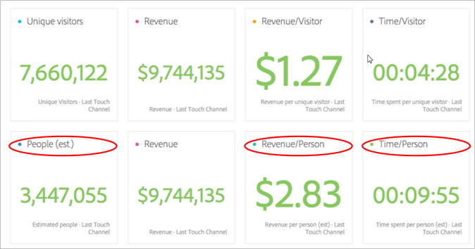
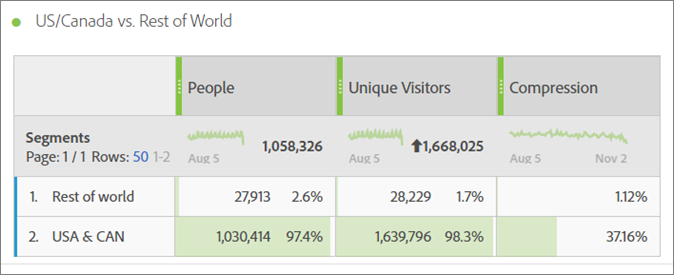
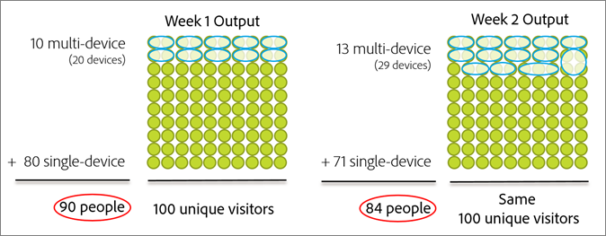
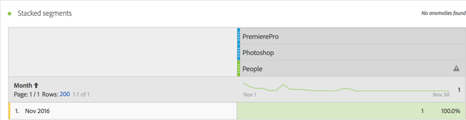
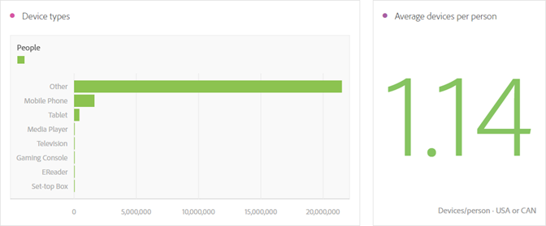
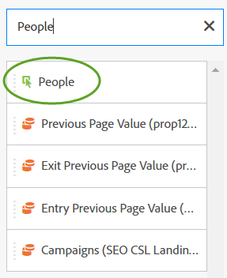

# Métrica de pessoas{#people-metric}

A métrica de Pessoas é a contagem de pessoas (ou de grupos de dispositivos) com base no Gráfico de dispositivos da Adobe. Você pode aplicar a métrica de Pessoas para identificar os visitantes em seus dispositivos na Analysis Workspace.

## People Metric Prerequisites and Considerations {#section-34551d0435fb4b3cb3fad736b7961541}

<table id="table_120F7EF50042485391E58B22DD00A2A8"> 
 <thead> 
  <tr> 
   <th colname="col1" class="entry"> Pré-requisito ou Consideração </th> 
   <th colname="col2" class="entry"> Descrição </th> 
  </tr>
 </thead>
 <tbody> 
  <tr> 
   <td colname="col1"> 
Dispositivo Cooperação 
 </td> 
   <td colname="col2"> 
 To use the People metric, become a member of the <a href="http://landing.adobe.com/en/na/events/summit/275658-summit-co-op.html" format="html" scope="external"> Adobe Experience Cloud Device Co-op</a>. A cooperativa identifica vários dispositivos de uma pessoa (ou Experience Cloud IDs). O Analytics utiliza estas informações para calcular estatisticamente o número de pessoas que interagem com uma marca. A métrica tem uma precisão de até 5%. 
 
<b>Regiões</b>: o Device Co-op está disponível atualmente apenas nos EUA e no Canadá. Portanto, ao avaliar a métrica de Pessoas, você deve aplicar um segmento à sua análise que filtra os dados apenas para os EUA e Canadá. 
 
A cada semana, o Gráfico de dispositivos calcula uma nova versão da cooperativa e a publica para uso. Às terças-feiras, o sistema coleta os dados mais recentes e publica uma versão atualizada do gráfico. As soluções da Experience Cloud usam a versão mais recente do gráfico. Especificamente para o Analytics, as alterações são lidas na quarta-feira e o processamento das alterações normalmente leva de 1 a 2 dias úteis. 
 
 
Importante:  Quando o gráfico é atualizado semanalmente, pode afetar historicamente a métrica de Pessoas. Em outras palavras, as contagens históricas de Pessoas podem mudar ao longo do tempo à medida que o gráfico aprende e é atualizado. Por exemplo, se você executar um relatório hoje que conta Pessoas no mês passado e, em seguida, executar o mesmo relatório em uma semana após a atualização do gráfico, a contagem histórica de Pessoas poderá mudar ligeiramente. 
 
 </td> 
  </tr> 
  <tr> 
   <td colname="col1"> Permissões de métrica </td> 
   <td colname="col2"> 
Você pode usar a métrica de Pessoas somente se tiver acesso a ela. Os administradores podem<a href="https://marketing.adobe.com/resources/help/en_US/reference/groups-metrics.html" format="html" scope="external"> personalizar as permissões</a> de métricas nas Ferramentas administrativas. 
 </td> 
  </tr> 
  <tr> 
   <td colname="col1"> Mapeamento para organização IMS </td> 
   <td colname="col2"> 
A métrica de Pessoas será ativada para todos os conjuntos de relatórios que estão <a href="https://marketing.adobe.com/resources/help/en_US/mcloud/map-report-suite.html" format="html" scope="external"> mapeados para um IMSORG</a>. 
 </td> 
  </tr> 
  <tr> 
   <td colname="col1"> 
Ferramentas/projetos de análise 
 </td> 
   <td colname="col2"> 
Use a métrica de Pessoas no Analysis Workspace, na Análise ad hoc, no Construtor de relatórios e através da API. Você pode usá-lo em qualquer lugar que usaria a métrica de Visitantes exclusivos, incluindo as Métricas calculadas. 
 
Por exemplo, crie uma métrica de receita por pessoa para substituir uma métrica de receita por visitante exclusivo. 
 
Um <a href="https://marketing.adobe.com/resources/help/en_US/analytics/analysis-workspace/starter_projects.html" format="html" scope="external">modelo de projeto de Pessoas</a> está disponível para começar a usar a métrica de Pessoas na Analysis Workspace. 
 </td> 
  </tr> 
  <tr> 
   <td colname="col1"> 
Ativar as regras de bots 
 </td> 
   <td colname="col2"> 
A Adobe recomenda ativar as <a href="https://marketing.adobe.com/resources/help/en_US/reference/bot_rules.html" format="html" scope="external">Regras de bot</a>, especialmente ao utilizar a métrica de Pessoas. 
 
Quando um bot rastreia o seu site, ele aumenta artificialmente sua contagem de Visitantes únicos. Remover o tráfego de bot do seu conjunto de relatórios permite uma medição mais precisa da atividade em suas propriedades digitais, em termos de Visitantes únicos e Pessoas. 
 
Para fazer isso, navegue para Analytics &gt; Admin &gt; Conjuntos de relatórios. Selecione o conjunto de relatórios correto e vá para Editar configurações &gt; Geral &gt; Regras de bot. 
 </td> 
  </tr> 
  <tr> 
   <td colname="col1"> 
Considerações de segmentação 
 </td> 
   <td colname="col2"> 
 Quando você usa segmentos com a métrica de Pessoas, o relatório da métrica pode ser significativamente menor do que o esperado. 
 
Consulte <a href="../other-solutions/people.md#section-d03525420dbe48379fd95b230ef05885" format="dita" scope="local">Usando a métrica de Pessoas com segmentos</a>. 
 </td> 
  </tr> 
 </tbody> 
</table>

## O que é a métrica de pessoas? {#section-89e2b8f5e80f480391449fc8d1117a6a}

A métrica de Pessoas é uma métrica de relatório do Analytics que ajuda a atribuir dispositivos às pessoas. Ela fornece uma visão de marketing baseada em pessoas, permitindo medir a atividade dos visitantes em todos os seus dispositivos. Pense nisso como uma versão desduplicada de Visitantes únicos; você pode usar a métrica de Pessoas para análises em que utilizou a métrica Visitantes únicos anteriormente.

**Dispositivos são pessoas**

Antes da métrica de Pessoas ser disponibilizada, uma pessoa (por exemplo) podia visitar o seu site e se envolver com uma campanha ou marca em três dispositivos diferentes e fazer uma compra, mesmo em poucos minutos. Dependendo da sua implementação, o Analytics podia relatar cada dispositivo como um visitante único e atribuir $10 a três dispositivos em uma compra de $30.

A métrica de Pessoas permite atribuir com precisão a compra de $30 a uma pessoa:

**Precisão aumentada em relatórios**

A métrica de Pessoas permite considerar vários dispositivos como uma única entidade. O seguinte projeto da Analysis Workspace mostra comparações do aumento de precisão entre os relatórios de Visitantes únicos e os relatórios de Pessoas:

Compare Pessoas e Visitantes únicos lado a lado:

**Definições**

<table id="table_F8171AF15DA64607B427E3739EF004D6"> 
 <thead> 
  <tr> 
   <th colname="col1" class="entry"> Item </th> 
   <th colname="col2" class="entry"> Descrição </th> 
  </tr>
 </thead>
 <tbody> 
  <tr> 
   <td colname="col1"> 
Pessoas 
 </td> 
   <td colname="col2"> 
A métrica de Pessoas baseia-se na ideia de que os consumidores interagem com a sua marca usando vários dispositivos. Quanto mais você divide ou segmenta os dados, menor será a chance de que uma mesma pessoa utilize vários dispositivos dentro dessa fatia de dados. 
 </td> 
  </tr> 
  <tr> 
   <td colname="col1"> 
Visitantes únicos 
 </td> 
   <td colname="col2"> 
Por exemplo, quanto mais você divide os seus dados por data ou hora, menor será a diferença entre as métricas de Pessoas e Visitantes únicos. Se você quiser ter uma boa compreensão do impacto geral do Device Co-op, a Adobe recomenda usar um intervalo de datas dos últimos 90 dias 
 </td> 
  </tr> 
  <tr> 
   <td colname="col1"> 
Compactação 
 </td> 
   <td colname="col2"> 
Usando uma simples métrica calculada você pode ver o quão menor a métrica de Pessoas é como uma porcentagem de Visitantes únicos. Clique no ícone de informações ao lado de “Compressão” na tabela acima para ver como criar essa métrica. 
 
A métrica de Pessoas pode ser usados em outras métricas calculadas no lugar de Visitantes únicos. 
 </td> 
  </tr> 
 </tbody> 
</table>

## Como a métrica de Pessoas é calculada? {#section-0dfb762867e14a7f927796ef3c50592b}

<!--

Analytics uses the HyperLogLog statistical algorithm to calculate People. This means that the smaller the data set, the margin for error may increase. No more than 5% of the numbers should be off by more than 5% 

-->

A imagem a seguir mostra como a métrica de Pessoas é calculada e como ela pode se reduzir ao longo do tempo para o mesmo intervalo de datas de um relatório no passado.

Neste exemplo, suponha que há um conjunto fixo de visitantes. Se você executar um relatório para um período fixo no passado, ele exibirá um conjunto fixo de visitantes. Se o Gráfico de dispositivos exibir os dados mostrados no gráfico à esquerda na semana 1, o resultado seria 90 pessoas. Uma semana depois, após a próxima execução do Gráfico de dispositivos, novas informações são consideradas. Se você executar o mesmo relatório da semana anterior, o número de pessoas diminuirá para 84. O histórico mudou porque o Gráfico de dispositivos forneceu novas informações sobre quais dispositivos devem ser agrupados.

## Usando a métrica de Pessoas com segmentos {#section-d03525420dbe48379fd95b230ef05885}

Quando você usa segmentos com a métrica de Pessoas, os resultados da métrica podem ser significativamente menores do que o esperado. Esse problema ocorre porque não há um *`person`* container. A segmentação utiliza o contêiner Visitante, que é o contêiner de mais alto nível na definição e se baseia no dispositivo, e não na pessoa.

Esse problema ocorre principalmente ao empilhar segmentos com a métrica de Pessoas.

O empilhamento de segmentos cria um novo segmento que representa a combinação dos segmentos. O empilhamento de segmentos ocorre sempre que você:

* Coloca um segmento em cima de outro na Analysis Workspace. (Eles são automaticamente associados usando o operador *`And`* operador.)
* Apply a single segment that contains the *`And`* operator.
* Aplica um segmento, em nível de projeto e em nível de tabela.
* Usa um conjunto de relatório virtual com outro segmento.

Por exemplo, suponha que você empilhe os seguintes segmentos sobre a métrica de Pessoas:

* `Campaign = Spring Promotion`
* `Site Section = Product Overview`

Only the number of people who qualify in both segments *`using a single device`* are counted. (A métrica de Pessoas não exibe o número de pessoas qualificadas em todos os dispositivos.)

Além disso, usar o operador *`Or`* não é recomendado nesta situação. Fazer isso produziria uma contagem de pessoas que visualizaram um ou o outro, sem permitir a contagem de pessoas qualificadas para ambos os segmentos.

Consulte [Criação de segmentos](https://marketing.adobe.com/resources/help/en_US/analytics/segment/seg_build.html) na ajuda de segmentação para obter mais informações.

## Tipos de dispositivo {#section-8ab378c84ff34574b9c20fecb3848a86}

O Device Co-op e a métrica de Pessoas funcionam melhor no Adobe Analytics quando seu conjunto de relatório contém dados de vários tipos de dispositivos. Por exemplo, a combinação de dados da web e de aplicativos no mesmo conjunto de relatório torna a métrica de Pessoas mais potente e eficaz. Quanto maior o cruzamento de dispositivos em seus dados, maior será a chance de que vários visitantes únicos sejam agrupados como uma única pessoa.

## Experience Cloud ID Service Coverage {#section-bbf0098cac2e467289e7a644a1dea05c}

O Device Co-op exige que suas propriedades digitais sejam instrumentadas usando o serviço da Experience Cloud ID (MCID). Se os dados no conjunto de relatório contiverem um número significativo de visitantes sem uma MCID, a eficácia do Device Co-op e da métrica de Pessoas será reduzida.

<!--
mcdc-people-metric-apply.xml
-->

In Analysis Workspace, create a [project](https://marketing.adobe.com/resources/help/en_US/analytics/analysis-workspace/t_freeform_project.html), then drag the **[!UICONTROL People]** metric to the project table:

