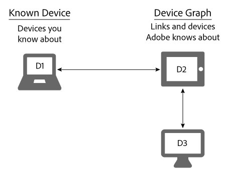

# Dispositivos conhecidos{#known-devices}

Sobre dispositivos conhecidos no Gráfico de dispositivos.

No Gráfico de dispositivos, temos o conceito de uma *`known device`*. Um dispositivo conhecido é um dispositivo que um cliente usa para interagir com sua marca.

>[!NOTE]
>
>No [!DNL Adobe Experience Cloud Device Co-op], termos como *`device`*, *`person`*, *`identity`* etc. têm significados específicos. Por exemplo, &quot;dispositivo&quot; pode se referir a hardware físico, como um telefone ou tablet e os aplicativos executados nesse hardware. Consulte a [glossário](../glossary.md#glossgroup-0f47d7fbd76c4759801f565f341a386c) para definições.

## Suporte a metas com o dispositivo conhecido {#section-80deae33660e4280ac65c659ceff5601}

O conceito conhecido de dispositivo oferece suporte a algumas metas essenciais para a criação e a manutenção de um [!DNL Device Co-op] programa. Um dispositivo conhecido é aquele que um [!DNL Device Co-op] o membro sabe sobre o a partir de alguma interação com um consumidor (por exemplo, uma visita ao site ou usando um aplicativo móvel). Com base nestas ações, a Comissão [!DNL Device Graph] vincula os dispositivos conhecidos de um [!DNL Device Co-op] membro de dispositivos contribuídos por outros [!DNL Device Co-op] membros. Esses links podem ser [determinístico ou probabilístico](../processes/links.md#concept-58bb7ab25f904f5f98d645e35205c931). Estes benefícios [!DNL Device Co-op] membros porque recebem:

* Mais dados sobre os dispositivos conhecidos.
* Novas informações sobre outros dispositivos vinculados.

A variável [!DNL Device Graph] O não fornecerá informações sobre clusters de dispositivos que um membro do Device Co-op não viu.

## Metas do Device Co-op {#section-75aea5a102d54733aae2a7c6ee9ec6c7}

Três objetivos principais animam a [!DNL Device Co-op]. As melhorias incluem:

* **Escala:** Compartilhe o número máximo de links possíveis em vários casos de uso.
* **Equidade:** Certifique-se de que cada membro da [!DNL Device Co-op] proporcionais às suas contribuições.

* **Confiança do consumidor:** Mantenha e aumente a confiança do consumidor, garantindo que a experiência do consumidor em vários dispositivos envolva marcas que ele já conhece e nas quais confia.

## Dimensionar e o dispositivo conhecido {#section-67f734109762457ca62ec306284ea082}

Os métodos a seguir são as maneiras mais comuns de um dispositivo se qualificar como um dispositivo conhecido. Tendo em conta estes [!DNL Device Co-op] os membros quase sempre terão pelo menos um dispositivo conhecido. Tal apoia o objetivo de proporcionar uma escala máxima a todos os [!DNL Device Co-op].

**Orgânico**

* Da visita de um cliente ao seu site ou usando seu aplicativo. Essa é uma qualificação de dados primários.
* Por clientes de integração de um sistema CRM.

**Marketplace**

* Compra de dados de segmento do Audience Marketplace.
* Da compra de dados de um provedor de dados de terceiros.

**Advertising**

Ao obter o inventário em um leilão e veicular um anúncio em um dispositivo. O dispositivo se torna um dispositivo conhecido se esse anúncio contiver um [!DNL Audience Manager] pixel.

## Dispositivos conhecidos e casos de uso de integridade {#section-0543188729d845d6b95db70b8b25e9f8}

Membros da [!DNL Device Co-op] obter links proporcionais às suas contribuições para o [!DNL Device Graph]. Empresas que contribuem com muitos dispositivos para a [!DNL Device Graph] receber mais links do que membros que contribuem com apenas alguns. Acreditamos que isso ajude a tornar o [!DNL Device Co-op] equitativo para todos os seus membros. Vamos analisar como isso funciona com os casos de uso grandes e pequenos descritos abaixo.

**Marca A: caso de uso grande**

Neste exemplo, a Marca A tem 100 visitantes do site por mês e inicia uma nova campanha entre dispositivos e marcas. Para simplificar, considere [!DNL Device Graph] A sabe que todos os visitantes da Marca A estão vinculados a 1 dispositivo adicional. Isso significa que a Marca A pode atingir outros 100 dispositivos. Além disso, a [!DNL Device Graph] O contém cerca de 200 dispositivos vinculados.

<table id="table_78C38DC522F94BC38C1DB73740C058AC"> 
 <thead> 
  <tr> 
   <th colname="col1" class="entry"> Dispositivos conhecidos/mês </th> 
   <th colname="col2" class="entry"> Dispositivos vinculados recebidos do Device Co-op </th> 
   <th colname="col3" class="entry"> Total de dispositivos do Campaign </th> 
  </tr>
 </thead>
 <tbody> 
  <tr> 
   <td colname="col1"> 
100 
 </td> 
   <td colname="col2"> 
100 
 </td> 
   <td colname="col3"> 
200 
 </td> 
  </tr> 
 </tbody> 
</table>

**Marca B: caso de uso pequeno**

Neste exemplo, a Marca B tem 100 visitantes do site por mês e inicia uma nova campanha entre dispositivos e marcas. Para simplificar, considere [!DNL Device Graph] O sabe que todos os visitantes da Marca B estão vinculados a 50 dispositivos adicionais. Isso significa que a Marca B pode atingir 150 dispositivos. Além disso, a [!DNL Device Graph] O contém cerca de 1.000 dispositivos vinculados.

<table id="table_A6C9CCF9C6564A89BA7060E075A8E73C"> 
 <thead> 
  <tr> 
   <th colname="col1" class="entry"> Dispositivos conhecidos/mês </th> 
   <th colname="col2" class="entry"> Dispositivos vinculados recebidos do Device Co-op </th> 
   <th colname="col3" class="entry"> Total de dispositivos do Campaign </th> 
  </tr>
 </thead>
 <tbody> 
  <tr> 
   <td colname="col1"> 
100 
 </td> 
   <td colname="col2"> 
50 
 </td> 
   <td colname="col3"> 
150 
 </td> 
  </tr> 
 </tbody> 
</table>

>[!MORELIKETHIS]
>
>* [Dispositivos desconhecidos](../processes/unknown-device.md#concept-95090d341cdc4c22ba4319d79d8f6e40)

