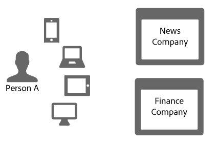
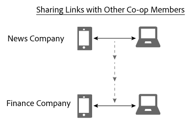

# Compartilhamento de links no Gráfico de dispositivos{#link-sharing-in-the-device-graph}

Sobre o compartilhamento de links no Gráfico de dispositivos.

O [!DNL Device Graph] compartilha links determinísticos e probabilísticos com diferentes membros do Adobe Experience Cloud Device Co-op. O compartilhamento de links é o que torna os [!DNL Device Co-op] mais poderosos. Ele estende o que cada membro sabe sobre os dispositivos associados a uma pessoa anônima, mas somente se você já tiver visto pelo menos um dos dispositivos dessa pessoa anônima antes.

## Revisão de resumo do Gráfico de dispositivos {#section-7858e9f61b5644c981ffb53626fcc19d}

Antes de começar, vamos dar um momento para rever como as [!DNL Device Graph] coisas funcionam. Os membros do [!DNL Device Co-op] enviam dados para o [!DNL Device Graph]. O [!DNL Device Graph] usa esses dados para construir a identidade de uma pessoa a partir de links  determinísticos e probabilísticos entre dispositivos. Como [!DNL Device Co-op] participantes, esses links fornecem informações sobre a relação entre os usuários autenticados, outros usuários e seus dispositivos. Vamos ver como isso funciona na seção abaixo.

## Exemplo de compartilhamento de link {#section-cb410d827cf14f76bc9b0bd4d31ed767}

O exemplo a seguir demonstra o poder do compartilhamento de links no Device Co-op. Neste exemplo, temos duas empresas fictícias, a Empresa de Notícias e a Empresa de Finanças. Ambas as empresas são membros do [!DNL Device Co-op]. A Pessoa A é um consumidor que faz logon ou navega nos sites de cada empresa a partir de vários dispositivos.

Como a Pessoa A foi autenticada no site de notícias com seu telefone celular e tablet, a Empresa de notícias a identifica com uma ID do consumidor. Ele envia essa ID para o [!DNL Device Graph] como um hash criptográfico. A Empresa das Finanças já viu esses dispositivos, mas a Pessoa A não fez logon no site. Consequentemente, a Empresa das Finanças não sabe se ou como esses dispositivos se relacionam entre si ou como estão associados à Pessoa A.

Dado o hash criptográfico da ID do consumidor, o [!DNL Device Graph] reconhece que esses dispositivos estão relacionados entre si e com uma pessoa específica. Para empresas que não participam dessas visitas ao site, parece que elas vêm de dispositivos separados e aleatórios. [!DNL Device Co-op] Em qualquer caso, uma vez que a ID [!DNL Device Graph] com hash for exibida, ela:

* Sabe que o celular e o laptop estão vinculados.
* Reconhece que a Empresa das Finanças quer saber se o telefone celular e o laptop estão vinculados.

Dadas essas condições, o [!DNL Device Graph] agora compartilha o link que conecta esses dispositivos para a Empresa de notícias com a Empresa de finanças. Durante esse processo, os [!DNL Device Graph] duplicados e compartilham o link de um membro da cooperativa para outro.

Nesse ponto, o [!DNL Device Graph] desempenhou sua função com sucesso. Tanto a Empresa de Notícias como a Empresa de Finanças têm uma imagem clara de uma identidade. Eles podem alcançar a Pessoa A com precisão em todos os dispositivos.

## Privacidade e compartilhamento de links {#section-7b566018b3304420a4b3e4c079826110}

A manutenção da privacidade do consumidor e da integridade dos dados para [!DNL Device Co-op] os membros é fundamental em todo o processo de compartilhamento de links. Durante esse processo de identificação do cliente e compartilhamento de links, o [!DNL Device Graph] não:

* Diga à Empresa de finanças que o link veio da Empresa de notícias.
* Compartilhe a ID do cliente usada por um [!DNL Device Co-op] membro com outro.
* Forneça quaisquer informações além de que o dispositivo móvel e o laptop compartilham um link em comum.

## Próximas etapas {#section-ac6e61f1eb6e45b1bb4be8ece39147c7}

Ler a documentação sobre identidade, vinculação e compartilhamento de links deve dar uma boa noção de como os dados são [!DNL Device Graph] montados internamente. Como próximo passo, recomendamos consultar nossa documentação que descreve como o conceito de um dispositivo *`known device`* fornece links entre dispositivos para membros do Device Co-op. Consulte Dispositivos  conhecidos e dispositivos [desconhecidos](../processes/unknown-device.md#concept-95090d341cdc4c22ba4319d79d8f6e40).
