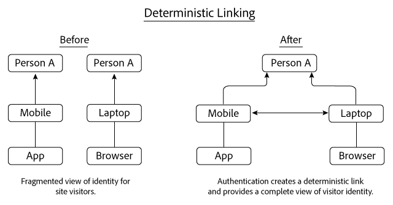
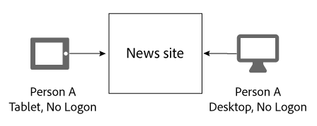
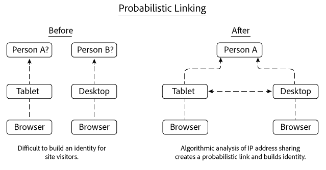
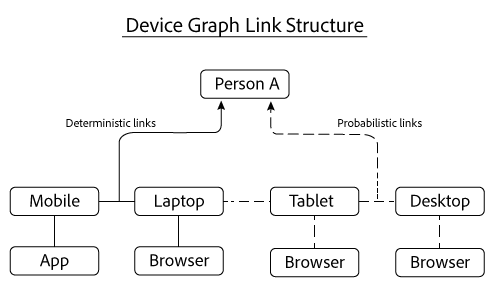

# Deterministic and probabilistic links{#deterministic-and-probabilistic-links}

Como o Gráfico de dispositivos analisa dados determinísticos e probabilísticos para criar um mapa que vincula dispositivos.

In the [!DNL Device Graph], internal processes build an identity hierarchy that maps devices and connects them to individual, anonymized people. A saída do gráfico inclui links entre dispositivos que podem ser usados para definição de metas juntamente com dados expostos em soluções selecionadas da Experience Cloud. The Adobe solutions that work with [!DNL Device Graph] data include Analytics, Audience Manager, Media Optimizer, and Target.

The [!DNL Device Graph] analyzes deterministic and probabilistic data to build a map that links devices together. Os dados determinísticos vinculam os dispositivos com base em informações de logon em hash. Os dados probabilísticos vinculam os dispositivos com base em informações como endereços IP e outros metadados. The [!DNL Device Graph] associates the linked device clusters to an anonymous individual person These connections let digital marketers reach people instead of devices. In the [!DNL Device Graph], the owner of a device is the anonymous representation of a real-life person. Ambos os links determinísticos e probabilísticos ajudam a criar uma estrutura de identidade do usuário.

>[!NOTE]
>
>No Adobe Experience Cloud Device Co-op, termos como *dispositivo*, *pessoa* e *identidade* têm significados específicos. For example, *device* can refer to physical hardware such as a phone or tablet and the applications that run on that hardware. Consulte o [glossário](../glossary.md#glossgroup-0f47d7fbd76c4759801f565f341a386c) para obter as definições.

## What are links? {#section-2df4c6f01eba49369993146df0661f13}

Quando falamos de links, é importante ter em mente o que eles são no contexto do Gráfico de dispositivos da [!DNL Experience Cloud]. Neste contexto, os links não são conexões físicas entre os dispositivos. Em vez disso, um link é como o Gráfico de Gráfico de dispositivos associa diferentes dispositivos para a mesma pessoa desconhecida. Por exemplo, digamos que temos um telefone celular e um navegador de desktop. O telefone e o navegador podem ser considerados “vinculados” uma vez que o Gráfico de dispositivos determinar que estes dispositivos são utilizados pela mesma pessoa desconhecida. Como você lerá abaixo, o Gráfico de dispositivos constrói identidades com links determinísticos e probabilísticos. E, no Gráfico de dispositivos, o proprietário de um dispositivo é a representação anônima de uma pessoa real.

## Deterministic links {#section-33d41e828a674b398e36fe63da20ac09}

Links determinísticos associam um dispositivo a uma pessoa com base em um evento de autenticação (por exemplo, uma ação de logon em um site a partir de um dispositivo). Esta ação cria um identificador anônimo conhecido como uma ID do consumidor. Vejamos como os links determinísticos funcionam. Neste exemplo, a Pessoa A faz logon em um site de notícias através de um aplicativo em seu dispositivo móvel. Mais tarde naquele dia, a Pessoa A faz logon novamente, mas desta vez através de um navegador em seu laptop.

Com base nas informações de logon, o Gráfico de dispositivos:

* Sabe que a Pessoa A está autenticada no site de notícias com uma combinação de telefone/aplicativo móvel e laptop/navegador.
* Vincula estes dispositivos à Pessoa A.
* Constrói uma identidade baseada em dispositivos vinculados associados a uma pessoa anônima.

>[!NOTE]
>
>Nem o usuário [!DNL Adobe Experience Cloud Device Co-op] ou o [!DNL Device Graph] recebe informações de autenticação reais ou informações de identificação pessoal (PII) nesses dados. Members of the [!DNL Experience Cloud Device Co-op], pass in cryptographically hashed, unique consumer IDs to the Device Graph. A ID do consumidor representa um usuário autenticado no gráfico e protege a privacidade do consumidor.

## Probabilistic links {#section-5f5aa755da984f9d851f7cb380262998}

Links probabilísticos conectam um dispositivo a uma pessoa através de algoritmos, com base em características e metadados, como:

* Comportamento de navegação
* Endereços IP
* Sistemas operacionais
* identificadores IDFA e GAID

Vejamos como os links probabilísticos funcionam. Neste exemplo, a Pessoa A navega para um site de notícias em seu tablet e depois de um computador desktop. Ao navegar, a Pessoa A não fazer logon no site de notícias. Durante cada visita separada, o tablet e o desktop compartilham o mesmo endereço IP.

Based on this information, the [!DNL Device Graph] evaluates IP address sharing patterns between both devices and links these devices together if the results suggest they belong to Person A. The end result is hierarchy of identity derived from algorithmic probability calculations.

Neste exemplo, o Gráfico de dispositivos vinculou ambos os dispositivos após terem sido usados para acessar o mesmo site de notícias. Mas, os dispositivos não têm de ser vistos no mesmo site para serem vinculados. Para ilustrar este ponto, vamos supor que cada dispositivo neste exemplo visite sites completamente diferentes. The [!DNL Device Graph] algorithm can still make a probabilistic link based on their shared IP address and from an analysis of other data. Este processo é o que ajuda a tornar os links probabilísticos tão poderosos para os membros do [!DNL Experience Cloud] Device Co-op.

## Both types of data provide value {#section-43d22d8c10634edcb261e7bda6fdf323}

Os dados determinísticos e probabilísticos complementam uns aos outros. Por outro lado, um gráfico de dispositivos que inclui apenas dados determinísticos fornece uma visão limitada da identidade de uma pessoa. Sem autenticação, um gráfico de dispositivos não poderá informá-lo sobre outros dispositivos e pessoas que navegam em seu site. Os dados probabilísticos podem fazer essas conexões e ajudar a alcançar dispositivos não autenticados, pessoas e residências.

Contudo, os dados determinísticos também são importantes. Eles podem, por exemplo, melhorar a tomada de decisões probabilísticas, removendo os links falsos gerados em locais onde os sinais probabilísticos são abundantes e sobrepostos (por exemplo, cafeterias, bibliotecas, aeroportos, etc.).

Com ambos os tipos de dados, o Gráfico de dispositivos fornece uma visão mais abrangente da identidade de uma pessoa do que com os tipos isolados.

